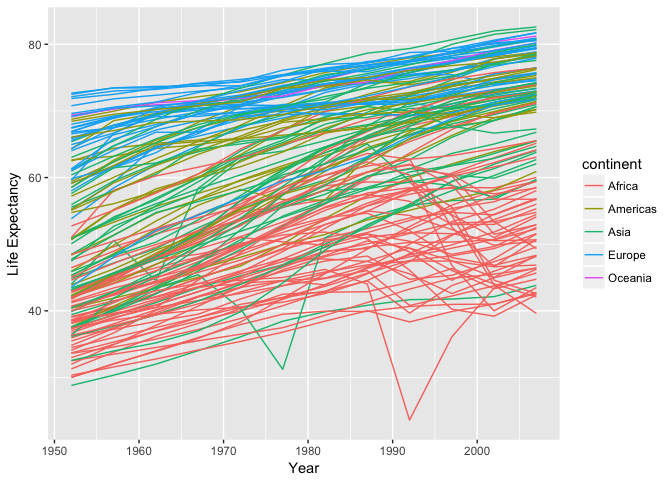
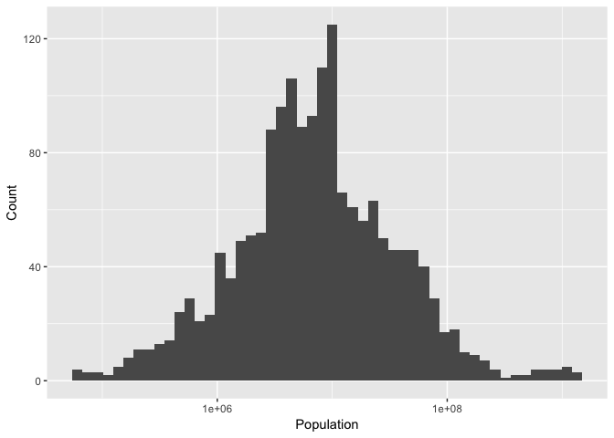
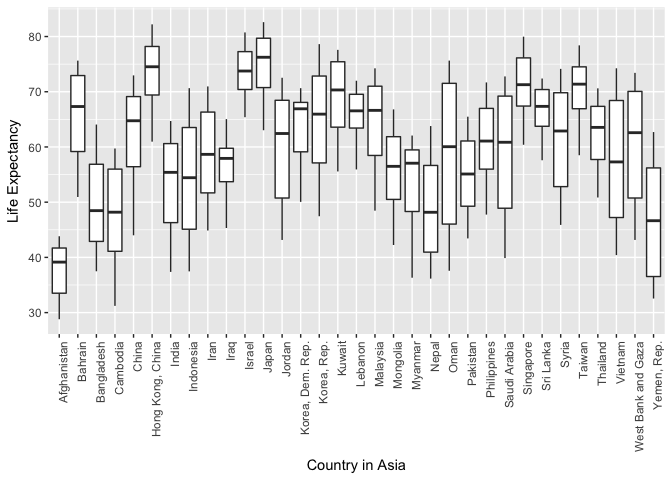
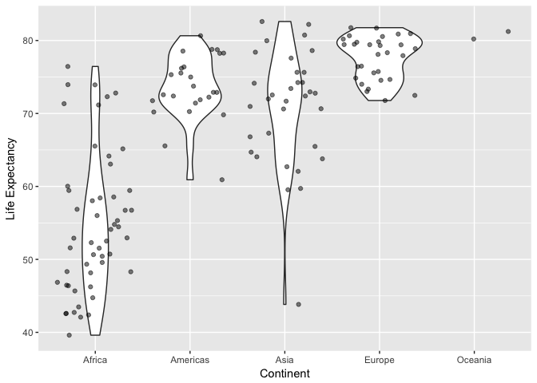

hw02-gapminder exploration
================
Frederike Basedow
25 September 2018

### Load the data and packages

``` r
library(gapminder)
library(tidyverse)
library(knitr)
```

### Smell test the data

*Explore the gapminder object:*

**1. Is it a data.frame, a matrix, a vector, a list?**

``` r
# Check for the structure and type of gapminder
head(gapminder)
```

    ## # A tibble: 6 x 6
    ##   country     continent  year lifeExp      pop gdpPercap
    ##   <fct>       <fct>     <int>   <dbl>    <int>     <dbl>
    ## 1 Afghanistan Asia       1952    28.8  8425333      779.
    ## 2 Afghanistan Asia       1957    30.3  9240934      821.
    ## 3 Afghanistan Asia       1962    32.0 10267083      853.
    ## 4 Afghanistan Asia       1967    34.0 11537966      836.
    ## 5 Afghanistan Asia       1972    36.1 13079460      740.
    ## 6 Afghanistan Asia       1977    38.4 14880372      786.

``` r
str(gapminder)
```

    ## Classes 'tbl_df', 'tbl' and 'data.frame':    1704 obs. of  6 variables:
    ##  $ country  : Factor w/ 142 levels "Afghanistan",..: 1 1 1 1 1 1 1 1 1 1 ...
    ##  $ continent: Factor w/ 5 levels "Africa","Americas",..: 3 3 3 3 3 3 3 3 3 3 ...
    ##  $ year     : int  1952 1957 1962 1967 1972 1977 1982 1987 1992 1997 ...
    ##  $ lifeExp  : num  28.8 30.3 32 34 36.1 ...
    ##  $ pop      : int  8425333 9240934 10267083 11537966 13079460 14880372 12881816 13867957 16317921 22227415 ...
    ##  $ gdpPercap: num  779 821 853 836 740 ...

Gapminder is a tibble, which is a special type of data frame.

**2. What is its class?**

``` r
class(gapminder)
```

    ## [1] "tbl_df"     "tbl"        "data.frame"

The classes included in gapminder are `tbl_df`, `tbl`, and `data.frame`.

**3. How many variables/columns?**

``` r
n_var <- ncol(gapminder) #store number of columns in new variable n_var
n_var
```

    ## [1] 6

Gapminder has 6 variables.

**4. How many rows/observations?**

``` r
n_obs <- nrow(gapminder) # store number of rows in new variable n_obs
n_obs
```

    ## [1] 1704

Gapminder has 1704 observations.

**5. Can you get these facts about “extent” or “size” in more than one way? Can you imagine different functions being useful in different contexts?**

Another way to get the number of rows and columns is to use the `dim()` function:

``` r
dim(gapminder)
```

    ## [1] 1704    6

Furthermore, the output of the `str()` function or just typing in the object's name also includes the dimensions of the object in its first line. `str()` is useful if you just want to get an overview of what the dimension are but not do anything with them. `dim()`, `nrow()` and `ncol()` are useful if you want to use the output numbers for future calculations. For example, you might want to use the total number of observations to calculate the mean. Here is an example for calculating the mean gdpPercap, making use of `n_obs` as specified above:

``` r
sum(gapminder$gdpPercap)/n_obs
```

    ## [1] 7215.327

`dim()` is a faster function than `ncol()` and `nrow()`, because the latter two functions actually use the `dim()` function. So it may be better to use dim() in loops that involve a lot of computing.

**6. What data type is each variable?**

``` r
sapply(gapminder, class) # using the sapply() function which returns a vector that is the same length as gapminder, i.e. applying it to each variable.
```

    ##   country continent      year   lifeExp       pop gdpPercap 
    ##  "factor"  "factor" "integer" "numeric" "integer" "numeric"

The first row shows the variable and the second row the respective type of each variable.

### Explore individual variables

*Pick at least one categorical variable and at least one quantitative variable to explore.*

I will explore `country` and `year` as categorical variables and `lifeExp` and `gdpPercap` as quantitative variables.

**1. What are possible values (or range, whichever is appropriate) of each variable?**

``` r
# get the lowest and highest value of lifeExp
r_lE <- range(gapminder$lifeExp) 
r_lE
```

    ## [1] 23.599 82.603

``` r
# get the number of countries
n_ct <- nlevels(gapminder$country) 
n_ct
```

    ## [1] 142

``` r
# get a list of each country in the data set
all_ct <- levels(gapminder$country) 
all_ct
```

    ##   [1] "Afghanistan"              "Albania"                 
    ##   [3] "Algeria"                  "Angola"                  
    ##   [5] "Argentina"                "Australia"               
    ##   [7] "Austria"                  "Bahrain"                 
    ##   [9] "Bangladesh"               "Belgium"                 
    ##  [11] "Benin"                    "Bolivia"                 
    ##  [13] "Bosnia and Herzegovina"   "Botswana"                
    ##  [15] "Brazil"                   "Bulgaria"                
    ##  [17] "Burkina Faso"             "Burundi"                 
    ##  [19] "Cambodia"                 "Cameroon"                
    ##  [21] "Canada"                   "Central African Republic"
    ##  [23] "Chad"                     "Chile"                   
    ##  [25] "China"                    "Colombia"                
    ##  [27] "Comoros"                  "Congo, Dem. Rep."        
    ##  [29] "Congo, Rep."              "Costa Rica"              
    ##  [31] "Cote d'Ivoire"            "Croatia"                 
    ##  [33] "Cuba"                     "Czech Republic"          
    ##  [35] "Denmark"                  "Djibouti"                
    ##  [37] "Dominican Republic"       "Ecuador"                 
    ##  [39] "Egypt"                    "El Salvador"             
    ##  [41] "Equatorial Guinea"        "Eritrea"                 
    ##  [43] "Ethiopia"                 "Finland"                 
    ##  [45] "France"                   "Gabon"                   
    ##  [47] "Gambia"                   "Germany"                 
    ##  [49] "Ghana"                    "Greece"                  
    ##  [51] "Guatemala"                "Guinea"                  
    ##  [53] "Guinea-Bissau"            "Haiti"                   
    ##  [55] "Honduras"                 "Hong Kong, China"        
    ##  [57] "Hungary"                  "Iceland"                 
    ##  [59] "India"                    "Indonesia"               
    ##  [61] "Iran"                     "Iraq"                    
    ##  [63] "Ireland"                  "Israel"                  
    ##  [65] "Italy"                    "Jamaica"                 
    ##  [67] "Japan"                    "Jordan"                  
    ##  [69] "Kenya"                    "Korea, Dem. Rep."        
    ##  [71] "Korea, Rep."              "Kuwait"                  
    ##  [73] "Lebanon"                  "Lesotho"                 
    ##  [75] "Liberia"                  "Libya"                   
    ##  [77] "Madagascar"               "Malawi"                  
    ##  [79] "Malaysia"                 "Mali"                    
    ##  [81] "Mauritania"               "Mauritius"               
    ##  [83] "Mexico"                   "Mongolia"                
    ##  [85] "Montenegro"               "Morocco"                 
    ##  [87] "Mozambique"               "Myanmar"                 
    ##  [89] "Namibia"                  "Nepal"                   
    ##  [91] "Netherlands"              "New Zealand"             
    ##  [93] "Nicaragua"                "Niger"                   
    ##  [95] "Nigeria"                  "Norway"                  
    ##  [97] "Oman"                     "Pakistan"                
    ##  [99] "Panama"                   "Paraguay"                
    ## [101] "Peru"                     "Philippines"             
    ## [103] "Poland"                   "Portugal"                
    ## [105] "Puerto Rico"              "Reunion"                 
    ## [107] "Romania"                  "Rwanda"                  
    ## [109] "Sao Tome and Principe"    "Saudi Arabia"            
    ## [111] "Senegal"                  "Serbia"                  
    ## [113] "Sierra Leone"             "Singapore"               
    ## [115] "Slovak Republic"          "Slovenia"                
    ## [117] "Somalia"                  "South Africa"            
    ## [119] "Spain"                    "Sri Lanka"               
    ## [121] "Sudan"                    "Swaziland"               
    ## [123] "Sweden"                   "Switzerland"             
    ## [125] "Syria"                    "Taiwan"                  
    ## [127] "Tanzania"                 "Thailand"                
    ## [129] "Togo"                     "Trinidad and Tobago"     
    ## [131] "Tunisia"                  "Turkey"                  
    ## [133] "Uganda"                   "United Kingdom"          
    ## [135] "United States"            "Uruguay"                 
    ## [137] "Venezuela"                "Vietnam"                 
    ## [139] "West Bank and Gaza"       "Yemen, Rep."             
    ## [141] "Zambia"                   "Zimbabwe"

``` r
# get a list of all years included in data set
all_ys <- levels(as.factor(gapminder$year)) 
all_ys
```

    ##  [1] "1952" "1957" "1962" "1967" "1972" "1977" "1982" "1987" "1992" "1997"
    ## [11] "2002" "2007"

``` r
# get the lowest and highest value of gdpPercap
r_gdp <- round(range(gapminder$gdpPercap),2) 
r_gdp
```

    ## [1]    241.17 113523.13

The `lifeExp` variable ranges from 23.599 to 82.603, there are 142 countries included in the data set and the `gdpPercap` variable ranges from 241.17 to 1.135231310^{5}.

**2. What values are typical? What’s the spread? What’s the distribution? Etc., tailored to the variable at hand.**

For this task, I will focus on one quantitative (`lifeExp`) and one categorical variable (`continent`) only. First, I will provide some statistics of the life expectancy and it's distribution, then I will show how many countries were recorded per continent.

Let's start with the life expectancy:

``` r
# get statistics of lifeExp variable, change them into a data frame for presenting in nice table with kable()
summary(gapminder$lifeExp) %>% 
  round(2) %>% # round the calculate values to two decimals
  as.matrix() %>% # change to matrix
  as.data.frame() %>% # change into data frame
  rownames_to_column() %>% # make the rownames (including stats description) into a column
  rename(Stat=rowname, Value=V1) %>% # change column names
  kable() #print in nice table
```

| Stat    |  Value|
|:--------|------:|
| Min.    |  23.60|
| 1st Qu. |  48.20|
| Median  |  60.71|
| Mean    |  59.47|
| 3rd Qu. |  70.85|
| Max.    |  82.60|

``` r
# make density plot for lifeExp variable
gapminder %>% 
  ggplot(aes(lifeExp)) + # lifeExp on x axis
  geom_density() + # density plot
  labs(x="Life Expectancy", y="Density") # change axis labels
```


Next I am going to show how many countries there are per continent. Assuming that the number of countries recorded is the same for every year, we can use the data for one specific year to answer this question. However, to make sure that the same number of countries is included in 1952 as in the whole data set, I will check if the number compares to the total number that I determined above.

``` r
# filter gapminder for year 1952
gm_fy <- gapminder %>% filter(year == 1952) 

# calculate number of countries recorded in 1952
n_ct_fy <- nlevels(gm_fy$country) 
n_ct_fy
```

    ## [1] 142

``` r
# check if number of countries in first year is the same as number of countries as calculate earlier with all levels of the country variable
n_ct_fy == n_ct 
```

    ## [1] TRUE

The number of countries recorded in the year 1952 is the same as the number of different countries in the whole variable `country`. So now we can plot the countries per continent for the year 1952.

``` r
# make bar graph of number of countries per continent with filtered data for year 1952
gm_fy %>% # gapminder data for year 1952 only
  ggplot(aes(continent)) + 
  geom_bar() +
  labs(x="Continent", y="Number of Countries")
```


To get a better idea of how life expectancy differs between different countries per continent and how it changed throughout the years, here is a plot that gives an overview of the life expectancy over the years per country, coloured by continent:

``` r
# make plot that shows lifeExp over the years per country with colour coding by continent
gapminder %>% 
  ggplot(aes(year,lifeExp)) +
  geom_line(aes(group=country, colour=continent)) + 
  labs(x="Year", y="Life Expectancy") 
```



### Explore various plot types

*Make a few plots, probably of the same variable you chose to characterize numerically. You can use the plot types we went over in class (cm006) to get an idea of what you’d like to make. Try to explore more than one plot type.*

**1. A scatterplot of two quantitative variables.**

I will use the two quantitative variables `lifeExp` and `gdpPercap`.

``` r
# make a scatterplot of gdpPercap vs. lifeExp for each continent
gapminder %>% 
  ggplot(aes(gdpPercap, lifeExp)) + 
  scale_x_log10() + #using log scale for gdpPercap
  geom_jitter(alpha=0.25) + # add some alpha transparency to jitter
  facet_wrap( ~continent) + # facetting by continent
  geom_smooth(method=lm) + # fit a linear regression line
  labs(x="GDP per capita", y=" Life Expectancy")
```


**2. A plot of one quantitative variable. Maybe a histogram or densityplot or frequency polygon.**

I will use the variable `pop` for this task.

``` r
# histogram for population, using a log scale.
gapminder %>% 
  ggplot(aes(pop)) +
  scale_x_log10() +
  geom_histogram(bins=50) + #change bins in histrogram to smaller width
  labs(x="Population", y="Count")
```



**3. A plot of one quantitative variable and one categorical. Maybe boxplots for several continents or countries.**

I will plot the GDP per capita for each continent in the year 1952 with a violin plot, including jitter. I will also include the life expectancy data on a colour scale that will be visible in the jitter plot.

``` r
gm_fy %>%  # use data previously filtered for year 1952
  ggplot(aes(continent, gdpPercap, colour=lifeExp)) +
  scale_y_log10() +
  geom_violin() +
  geom_jitter(alpha=0.5) +
  labs(x="Continent", y="GDP per capita")
```


To give another example of using filtered data, here is a boxplot of the life expectancy in each country in Asia.

``` r
gapminder %>% 
  filter(continent == "Asia") %>% 
  ggplot(aes(country, lifeExp)) +
  geom_boxplot() +
  theme(axis.text.x = element_text(angle = 90, hjust = 1)) + # change the angle of x labels
  labs(x="Country in Asia", y="Life Expectancy")
```



### Use filter(), select() and %&gt;%

**1. Use filter() to create data subsets that you want to plot. Practice piping together filter() and select(). Possibly even piping into ggplot().**

Here is a violin plot, including jitter, of the life expectancy in each continent in the year 2007.

``` r
gapminder %>% 
  filter(year == 2007) %>% 
  select(continent, country, lifeExp) %>% 
  ggplot(aes(continent, lifeExp)) +
  geom_violin() +
  geom_jitter(alpha=0.5) +
  labs(x="Continent", y="Life Expectancy")
```



### But I want to do more!

*Evaluate this code and describe the result. Presumably the analyst’s intent was to get the data for Rwanda and Afghanistan. Did they succeed? Why or why not? If not, what is the correct way to do this?*

``` r
filter(gapminder, country == c("Rwanda", "Afghanistan"))
```

    ## # A tibble: 12 x 6
    ##    country     continent  year lifeExp      pop gdpPercap
    ##    <fct>       <fct>     <int>   <dbl>    <int>     <dbl>
    ##  1 Afghanistan Asia       1957    30.3  9240934      821.
    ##  2 Afghanistan Asia       1967    34.0 11537966      836.
    ##  3 Afghanistan Asia       1977    38.4 14880372      786.
    ##  4 Afghanistan Asia       1987    40.8 13867957      852.
    ##  5 Afghanistan Asia       1997    41.8 22227415      635.
    ##  6 Afghanistan Asia       2007    43.8 31889923      975.
    ##  7 Rwanda      Africa     1952    40.0  2534927      493.
    ##  8 Rwanda      Africa     1962    43.0  3051242      597.
    ##  9 Rwanda      Africa     1972    44.6  3992121      591.
    ## 10 Rwanda      Africa     1982    46.2  5507565      882.
    ## 11 Rwanda      Africa     1992    23.6  7290203      737.
    ## 12 Rwanda      Africa     2002    43.4  7852401      786.

They did not succeed - the output doesn't include all of the data of Afghanistan and Rwanda, it only includes one data point per year while each year should be present for both countries. Here is a graph that makes that clear (using `lifeExp` as example):

``` r
filter(gapminder, country == c("Rwanda", "Afghanistan")) %>% 
  ggplot(aes(year, lifeExp, colour=country)) +
  geom_point() 
```


You can see that only one data point exists per year, of one country each. If I understand it correctly, this is because by using `==` to campare strings in character vectors, the data will be sorted in a specific way (that I don't fully understand).

The correct way is:

``` r
gapminder %>% 
  filter(country %in% c("Afghanistan", "Rwanda")) 
```

    ## # A tibble: 24 x 6
    ##    country     continent  year lifeExp      pop gdpPercap
    ##    <fct>       <fct>     <int>   <dbl>    <int>     <dbl>
    ##  1 Afghanistan Asia       1952    28.8  8425333      779.
    ##  2 Afghanistan Asia       1957    30.3  9240934      821.
    ##  3 Afghanistan Asia       1962    32.0 10267083      853.
    ##  4 Afghanistan Asia       1967    34.0 11537966      836.
    ##  5 Afghanistan Asia       1972    36.1 13079460      740.
    ##  6 Afghanistan Asia       1977    38.4 14880372      786.
    ##  7 Afghanistan Asia       1982    39.9 12881816      978.
    ##  8 Afghanistan Asia       1987    40.8 13867957      852.
    ##  9 Afghanistan Asia       1992    41.7 16317921      649.
    ## 10 Afghanistan Asia       1997    41.8 22227415      635.
    ## # ... with 14 more rows

``` r
# or

gapminder %>% 
  filter(country == "Afghanistan" | country =="Rwanda") 
```

    ## # A tibble: 24 x 6
    ##    country     continent  year lifeExp      pop gdpPercap
    ##    <fct>       <fct>     <int>   <dbl>    <int>     <dbl>
    ##  1 Afghanistan Asia       1952    28.8  8425333      779.
    ##  2 Afghanistan Asia       1957    30.3  9240934      821.
    ##  3 Afghanistan Asia       1962    32.0 10267083      853.
    ##  4 Afghanistan Asia       1967    34.0 11537966      836.
    ##  5 Afghanistan Asia       1972    36.1 13079460      740.
    ##  6 Afghanistan Asia       1977    38.4 14880372      786.
    ##  7 Afghanistan Asia       1982    39.9 12881816      978.
    ##  8 Afghanistan Asia       1987    40.8 13867957      852.
    ##  9 Afghanistan Asia       1992    41.7 16317921      649.
    ## 10 Afghanistan Asia       1997    41.8 22227415      635.
    ## # ... with 14 more rows

And here is a plot that shows that with the correct method two data points exist per year, one per country.

``` r
gapminder %>% 
  filter(country %in% c("Afghanistan", "Rwanda")) %>% 
  ggplot(aes(year, lifeExp, colour=country)) +
  geom_point()
```


