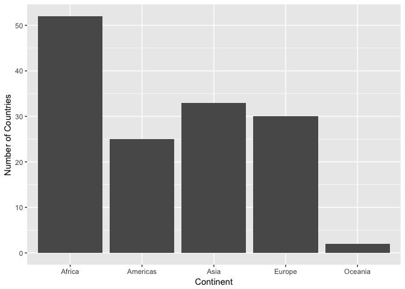

hw02-gapminder exploration
================
Frederike Basedow
22 September 2018

### Load the data and packages

``` r
library(gapminder)
library(tidyverse)
library(knitr)
```

### Smell test the data

Explore the gapminder object:

1.  Is it a data.frame, a matrix, a vector, a list?

``` r
# Check for the structure and type of gapminder
str(gapminder)
```

    ## Classes 'tbl_df', 'tbl' and 'data.frame':    1704 obs. of  6 variables:
    ##  $ country  : Factor w/ 142 levels "Afghanistan",..: 1 1 1 1 1 1 1 1 1 1 ...
    ##  $ continent: Factor w/ 5 levels "Africa","Americas",..: 3 3 3 3 3 3 3 3 3 3 ...
    ##  $ year     : int  1952 1957 1962 1967 1972 1977 1982 1987 1992 1997 ...
    ##  $ lifeExp  : num  28.8 30.3 32 34 36.1 ...
    ##  $ pop      : int  8425333 9240934 10267083 11537966 13079460 14880372 12881816 13867957 16317921 22227415 ...
    ##  $ gdpPercap: num  779 821 853 836 740 ...

``` r
typeof(gapminder)
```

    ## [1] "list"

Gapminder is a list that contains 3 different classes: table-data frame, table and data frame.

1.  What is its class?

``` r
class(gapminder)
```

    ## [1] "tbl_df"     "tbl"        "data.frame"

1.  How many variables/columns?

``` r
n_var <- ncol(gapminder)
n_var
```

    ## [1] 6

Gapminder has 6 variables.

1.  How many rows/observations?

``` r
n_obs <- nrow(gapminder)
n_obs
```

    ## [1] 1704

Gapminder has 1704 observations.

1.  Can you get these facts about “extent” or “size” in more than one way? Can you imagine different functions being useful in different contexts?

You can get the number of variables and observations with the functions `ncol()` and `nrow()`, respectively as I did above, but you could also use the function `str()`, that includes the number of variable and observations in its output. `str` is useful if you just want to get an overview of what your data set looks like, `nrow` and `ncol` are useful if you want to use these number for further calculations.

1.  What data type is each variable?

``` r
sapply(gapminder, class)
```

    ##   country continent      year   lifeExp       pop gdpPercap 
    ##  "factor"  "factor" "integer" "numeric" "integer" "numeric"

### Explore individual variables

Pick at least one categorical variable and at least one quantitative variable to explore.

I will explore `country` as a categorical variable and `lifeExp` as a quanititative variable.

1.  What are possible values (or range, whichever is appropriate) of each variable?

``` r
range(gapminder$lifeExp) # get the range of lifeExp
```

    ## [1] 23.599 82.603

``` r
nlevels(gapminder$country) # get the number of countries
```

    ## [1] 142

``` r
levels(gapminder$country) # get a list of each country in the data set
```

    ##   [1] "Afghanistan"              "Albania"                 
    ##   [3] "Algeria"                  "Angola"                  
    ##   [5] "Argentina"                "Australia"               
    ##   [7] "Austria"                  "Bahrain"                 
    ##   [9] "Bangladesh"               "Belgium"                 
    ##  [11] "Benin"                    "Bolivia"                 
    ##  [13] "Bosnia and Herzegovina"   "Botswana"                
    ##  [15] "Brazil"                   "Bulgaria"                
    ##  [17] "Burkina Faso"             "Burundi"                 
    ##  [19] "Cambodia"                 "Cameroon"                
    ##  [21] "Canada"                   "Central African Republic"
    ##  [23] "Chad"                     "Chile"                   
    ##  [25] "China"                    "Colombia"                
    ##  [27] "Comoros"                  "Congo, Dem. Rep."        
    ##  [29] "Congo, Rep."              "Costa Rica"              
    ##  [31] "Cote d'Ivoire"            "Croatia"                 
    ##  [33] "Cuba"                     "Czech Republic"          
    ##  [35] "Denmark"                  "Djibouti"                
    ##  [37] "Dominican Republic"       "Ecuador"                 
    ##  [39] "Egypt"                    "El Salvador"             
    ##  [41] "Equatorial Guinea"        "Eritrea"                 
    ##  [43] "Ethiopia"                 "Finland"                 
    ##  [45] "France"                   "Gabon"                   
    ##  [47] "Gambia"                   "Germany"                 
    ##  [49] "Ghana"                    "Greece"                  
    ##  [51] "Guatemala"                "Guinea"                  
    ##  [53] "Guinea-Bissau"            "Haiti"                   
    ##  [55] "Honduras"                 "Hong Kong, China"        
    ##  [57] "Hungary"                  "Iceland"                 
    ##  [59] "India"                    "Indonesia"               
    ##  [61] "Iran"                     "Iraq"                    
    ##  [63] "Ireland"                  "Israel"                  
    ##  [65] "Italy"                    "Jamaica"                 
    ##  [67] "Japan"                    "Jordan"                  
    ##  [69] "Kenya"                    "Korea, Dem. Rep."        
    ##  [71] "Korea, Rep."              "Kuwait"                  
    ##  [73] "Lebanon"                  "Lesotho"                 
    ##  [75] "Liberia"                  "Libya"                   
    ##  [77] "Madagascar"               "Malawi"                  
    ##  [79] "Malaysia"                 "Mali"                    
    ##  [81] "Mauritania"               "Mauritius"               
    ##  [83] "Mexico"                   "Mongolia"                
    ##  [85] "Montenegro"               "Morocco"                 
    ##  [87] "Mozambique"               "Myanmar"                 
    ##  [89] "Namibia"                  "Nepal"                   
    ##  [91] "Netherlands"              "New Zealand"             
    ##  [93] "Nicaragua"                "Niger"                   
    ##  [95] "Nigeria"                  "Norway"                  
    ##  [97] "Oman"                     "Pakistan"                
    ##  [99] "Panama"                   "Paraguay"                
    ## [101] "Peru"                     "Philippines"             
    ## [103] "Poland"                   "Portugal"                
    ## [105] "Puerto Rico"              "Reunion"                 
    ## [107] "Romania"                  "Rwanda"                  
    ## [109] "Sao Tome and Principe"    "Saudi Arabia"            
    ## [111] "Senegal"                  "Serbia"                  
    ## [113] "Sierra Leone"             "Singapore"               
    ## [115] "Slovak Republic"          "Slovenia"                
    ## [117] "Somalia"                  "South Africa"            
    ## [119] "Spain"                    "Sri Lanka"               
    ## [121] "Sudan"                    "Swaziland"               
    ## [123] "Sweden"                   "Switzerland"             
    ## [125] "Syria"                    "Taiwan"                  
    ## [127] "Tanzania"                 "Thailand"                
    ## [129] "Togo"                     "Trinidad and Tobago"     
    ## [131] "Tunisia"                  "Turkey"                  
    ## [133] "Uganda"                   "United Kingdom"          
    ## [135] "United States"            "Uruguay"                 
    ## [137] "Venezuela"                "Vietnam"                 
    ## [139] "West Bank and Gaza"       "Yemen, Rep."             
    ## [141] "Zambia"                   "Zimbabwe"

``` r
levels(as.factor(gapminder$year)) # get a list of all years included in data set
```

    ##  [1] "1952" "1957" "1962" "1967" "1972" "1977" "1982" "1987" "1992" "1997"
    ## [11] "2002" "2007"

1.  What values are typical? What’s the spread? What’s the distribution? Etc., tailored to the variable at hand.

lifeExp:

``` r
# get statistics of lifeExp variable, make them into a data frame for presenting in nice table with kable()
summary(gapminder$lifeExp) %>% as.matrix() %>% as.data.frame() %>% rownames_to_column() %>% rename(Stat=rowname, Value=V1) %>% kable()
```

| Stat    |     Value|
|:--------|---------:|
| Min.    |  23.59900|
| 1st Qu. |  48.19800|
| Median  |  60.71250|
| Mean    |  59.47444|
| 3rd Qu. |  70.84550|
| Max.    |  82.60300|

``` r
# make density plot for lifeExp variable
gapminder %>% 
  ggplot(aes(lifeExp)) + 
  geom_density()
```


``` r
# make plot that shows lifeExp over the years per country with clour coding per continent
gapminder %>% 
  ggplot(aes(year,lifeExp)) +
  geom_line(aes(group=country, colour=continent))
```


Feel free to use summary stats, tables, figures. We’re NOT expecting high production value (yet).

### Explore various plot types

Make a few plots, probably of the same variable you chose to characterize numerically. You can use the plot types we went over in class (cm006) to get an idea of what you’d like to make. Try to explore more than one plot type. Just as an example of what I mean:

1.  A scatterplot of two quantitative variables.

``` r
# make a scatterplot of lifeExp vs. gdpPercap
gapminder %>% 
  ggplot(aes(gdpPercap, lifeExp)) +
  geom_jitter() 
```


1.  A plot of one quantitative variable. Maybe a histogram or densityplot or frequency polygon.

``` r
# frequency pplygon for population
gapminder %>% 
  ggplot(aes(pop)) +
  geom_freqpoly()
```

    ## `stat_bin()` using `bins = 30`. Pick better value with `binwidth`.


1.  A plot of one quantitative variable and one categorical. Maybe boxplots for several continents or countries.

``` r
gapminder %>% 
  ggplot(aes(continent, lifeExp)) +
  geom_violin() +
  geom_jitter(alpha=0.25) +
  labs(x="Continent", y="Life Expectancy")
```


You don’t have to use all the data in every plot! It’s fine to filter down to one country or small handful of countries.

``` r
gapminder %>% filter(continent == "Asia") %>% 
  ggplot(aes(country, lifeExp)) +
  geom_boxplot() +
  theme(axis.text.x = element_text(angle = 90, hjust = 1))
```



### Use filter(), select() and %&gt;%

1.  Use filter() to create data subsets that you want to plot. Practice piping together filter() and select(). Possibly even piping into ggplot().

``` r
# i don't understand the use of `select()` when you're plotting data since you're selecting data in your plot settings anyways
gapminder %>% 
  select(continent, country, lifeExp, year) %>% 
  filter(year=="1952") %>% 
  ggplot(aes(continent, lifeExp)) +
  geom_violin() +
  geom_jitter()
```


### But I want to do more!

Evaluate this code and describe the result. Presumably the analyst’s intent was to get the data for Rwanda and Afghanistan. Did they succeed? Why or why not? If not, what is the correct way to do this?

``` r
filter(gapminder, country == c("Rwanda", "Afghanistan"))
```

    ## # A tibble: 12 x 6
    ##    country     continent  year lifeExp      pop gdpPercap
    ##    <fct>       <fct>     <int>   <dbl>    <int>     <dbl>
    ##  1 Afghanistan Asia       1957    30.3  9240934      821.
    ##  2 Afghanistan Asia       1967    34.0 11537966      836.
    ##  3 Afghanistan Asia       1977    38.4 14880372      786.
    ##  4 Afghanistan Asia       1987    40.8 13867957      852.
    ##  5 Afghanistan Asia       1997    41.8 22227415      635.
    ##  6 Afghanistan Asia       2007    43.8 31889923      975.
    ##  7 Rwanda      Africa     1952    40.0  2534927      493.
    ##  8 Rwanda      Africa     1962    43.0  3051242      597.
    ##  9 Rwanda      Africa     1972    44.6  3992121      591.
    ## 10 Rwanda      Africa     1982    46.2  5507565      882.
    ## 11 Rwanda      Africa     1992    23.6  7290203      737.
    ## 12 Rwanda      Africa     2002    43.4  7852401      786.

They did not succeed - the output doesn't include all of the data of Afghanistan and Rwanda, only one of the two for each year.

The correct way is:

``` r
gapminder %>% filter(country %in% c("Afghanistan", "Rwanda"))
```

    ## # A tibble: 24 x 6
    ##    country     continent  year lifeExp      pop gdpPercap
    ##    <fct>       <fct>     <int>   <dbl>    <int>     <dbl>
    ##  1 Afghanistan Asia       1952    28.8  8425333      779.
    ##  2 Afghanistan Asia       1957    30.3  9240934      821.
    ##  3 Afghanistan Asia       1962    32.0 10267083      853.
    ##  4 Afghanistan Asia       1967    34.0 11537966      836.
    ##  5 Afghanistan Asia       1972    36.1 13079460      740.
    ##  6 Afghanistan Asia       1977    38.4 14880372      786.
    ##  7 Afghanistan Asia       1982    39.9 12881816      978.
    ##  8 Afghanistan Asia       1987    40.8 13867957      852.
    ##  9 Afghanistan Asia       1992    41.7 16317921      649.
    ## 10 Afghanistan Asia       1997    41.8 22227415      635.
    ## # ... with 14 more rows

``` r
# or

gapminder %>% filter(country == "Afghanistan" | country =="Rwanda")
```

    ## # A tibble: 24 x 6
    ##    country     continent  year lifeExp      pop gdpPercap
    ##    <fct>       <fct>     <int>   <dbl>    <int>     <dbl>
    ##  1 Afghanistan Asia       1952    28.8  8425333      779.
    ##  2 Afghanistan Asia       1957    30.3  9240934      821.
    ##  3 Afghanistan Asia       1962    32.0 10267083      853.
    ##  4 Afghanistan Asia       1967    34.0 11537966      836.
    ##  5 Afghanistan Asia       1972    36.1 13079460      740.
    ##  6 Afghanistan Asia       1977    38.4 14880372      786.
    ##  7 Afghanistan Asia       1982    39.9 12881816      978.
    ##  8 Afghanistan Asia       1987    40.8 13867957      852.
    ##  9 Afghanistan Asia       1992    41.7 16317921      649.
    ## 10 Afghanistan Asia       1997    41.8 22227415      635.
    ## # ... with 14 more rows
